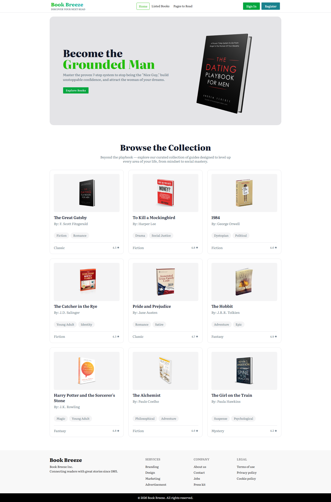
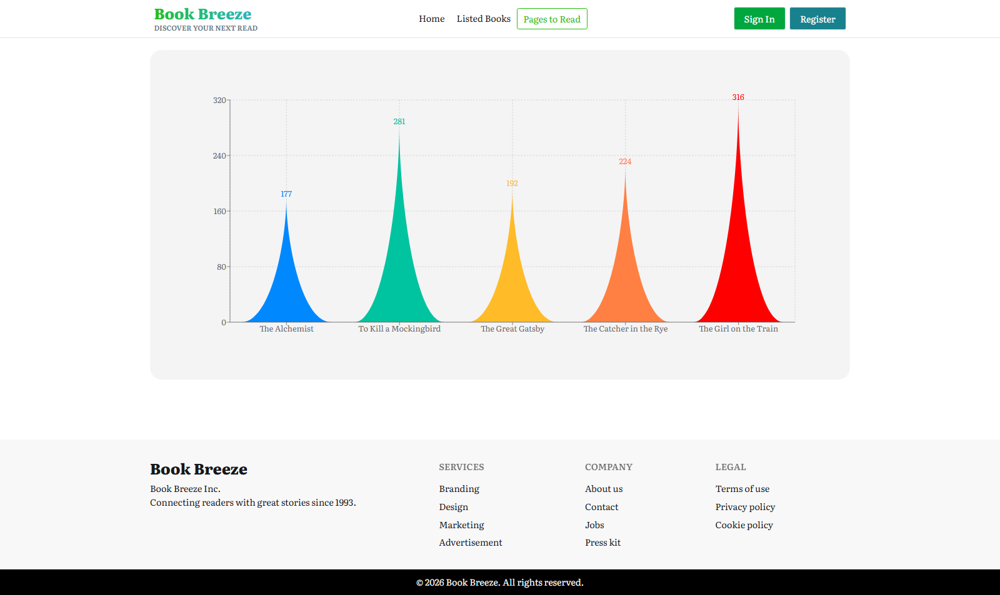
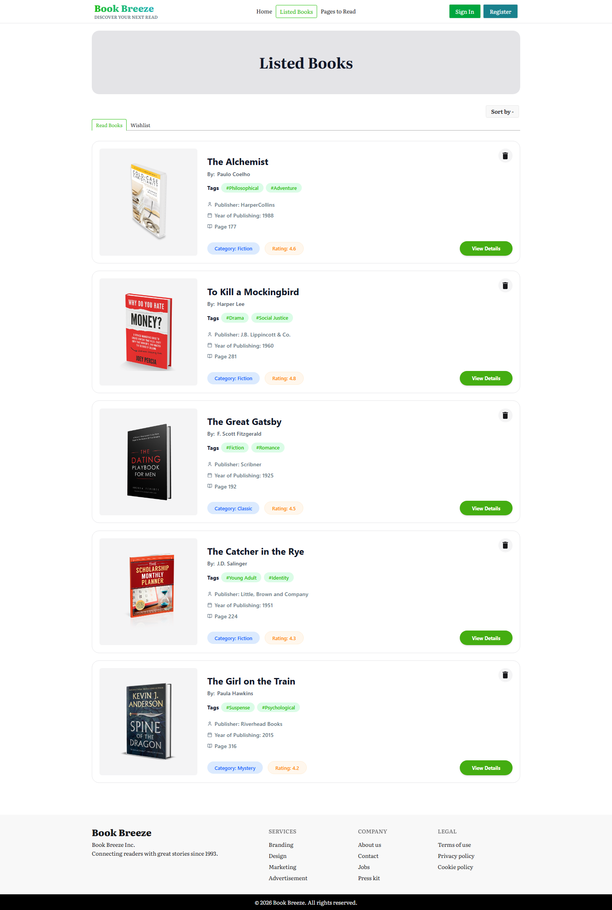

# 🚀 Book-Breeze
This is an assignment project of MERN stack course in programming hero batch 13. Focused on React.js, React-Router, React Context API.

This is a comprehensive Book Tracking Web App! A complete book-tracking ecosystem built from the ground. From custom data visualizations to a seamless "Read & Wishlist" flow, the result is pure satisfaction. 📈📖
This project allowed me to dive deep into state management and custom data visualization.

Live on Netlify - https://book-breeze-zunaid.netlify.app/ 
 
 

## Key Features:
✅ Data Viz: Custom-shaped Bar Charts using Recharts to track reading progress. 
✅ State Management: Integrated React Context API for seamless "Read" and "Wishlist" updates. 
✅ Dynamic Sorting: Advanced filtering by rating and page count (Asc/Desc). 
✅ Persistence: Local Storage integration to keep user data safe. 
✅ UI/UX: Built with TailwindCSS & DaisyUI, featuring interactive tabs, toast notifications, and smooth loading states. 

## Tech Stack:
⚛️ React.js — Component-based architecture 
🛣️ React Router — Seamless SPAs navigation 
🧠 Context API — Global state management 
📊 Recharts — Custom data viz for readers 
🎨 Tailwind CSS — Utility-first styling 
🌼 DaisyUI — Interactive UI components 
🌀 React Spinners — Smooth loading states 
🍞 React Toastify — Real-time user feedback 
📂 Local Storage — Persistent data tracking 

## 🚀 How to Run Locally

Clone the repository:

1. git clone https://github.com/ZunaidChowdhury/book-breeze
2. Install dependencies:
   npm install
3. Start the development server:
   npm run dev
   
 
 

# Screenshots

  
  
  

